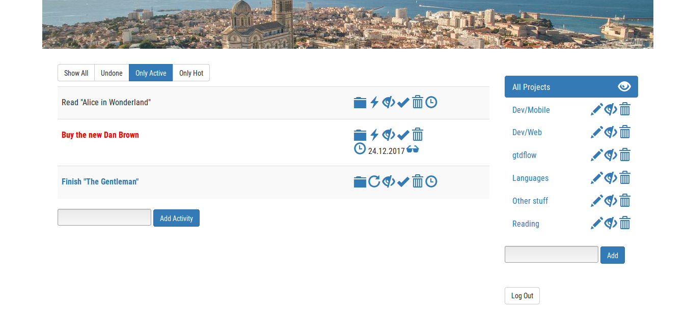
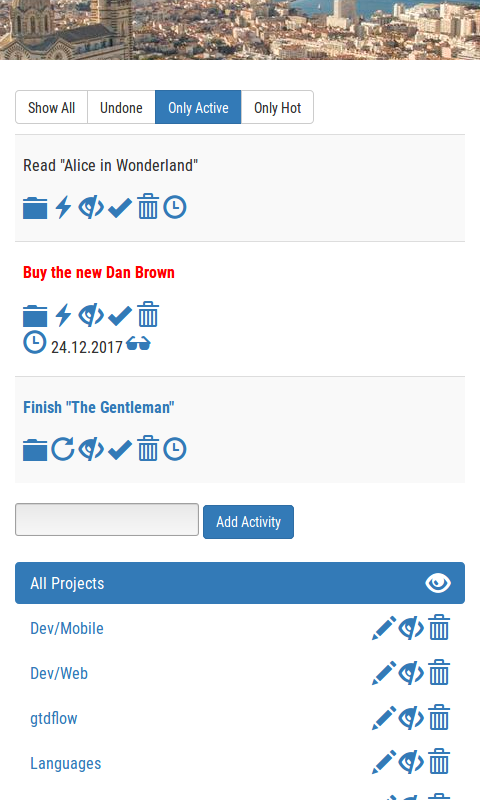

gtdflow
======= 
PWA for Getting Things Done (GTD) Activity List Management

The purpose of this simple app is to be able to view and to add/edit/delete items to GTD activity lists from wherever I am.

Technology
-------
* Frontend: Vue.js, Bootstrap
* Backend: Python Flask
* Database: MySQL

Screenshots
-------
Desktop

Mobile

Installation
-------
1. Clone this repo. 
1. Set up a Python 3 environment with Flask, SSLify, and MySQLdb.
1. Set up a MySQL database and apply [the schema](db/schema.sql). 
1. Copy [the config template](/config.py.template), name it `config.py` and set values that fit for your setup.
1. Start the app using the [start script](start) (run `./start` in the command line).

I recommend [PythonAnywhere](https://www.pythonanywhere.com/) to run Python web apps in the cloud, they have a free plan allowing you to run one app under a subdomain with free SSL and a limited MySQL database.

Once the Flask app is running, you can access it with a browser like a normal web page, or install it on your homescreen.

API
-------
See the [list of API calls](doc/REST-API.txt).

Limitations
-------
* No multi-user support
* UI is somewhat limited, e.g. you can't move an activity to another project, UX on mobile devices is certainly improvable, etc.

GTD Background
=======

What is *Getting Things Done*? 
-------
Getting Things Done (GTD) is a method to organize your life. It has been proposed by David Allen in his book *"Getting Things Done: The Art of Stress-Free Productivity"*.

The basic principle of GTD is the following:

*Whenever a new task pops up in your life which would take longer than two minutes to accomplish, write it down as a new activity, do it later and continue with your current work.*

The central items of my GTD workflow are **projects** and **activities**. 

A **project** in GTD always corresponds to a goal in my life. Projects may be short-term or long-term, it does not make much of a difference. 

An **activity** is something that I either have to or want to do in order to make progress in a project. Activities in GTD should always be as specific as possible. Each activity is assigned to a project.